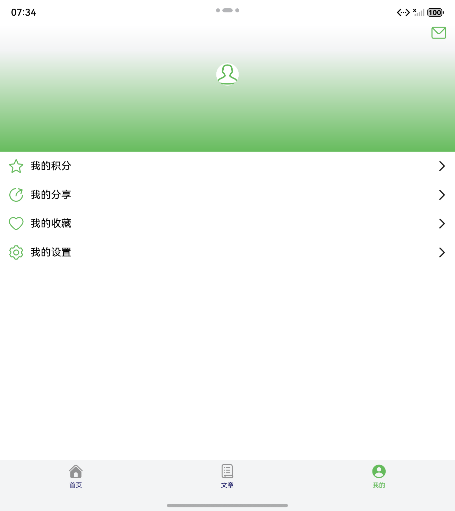
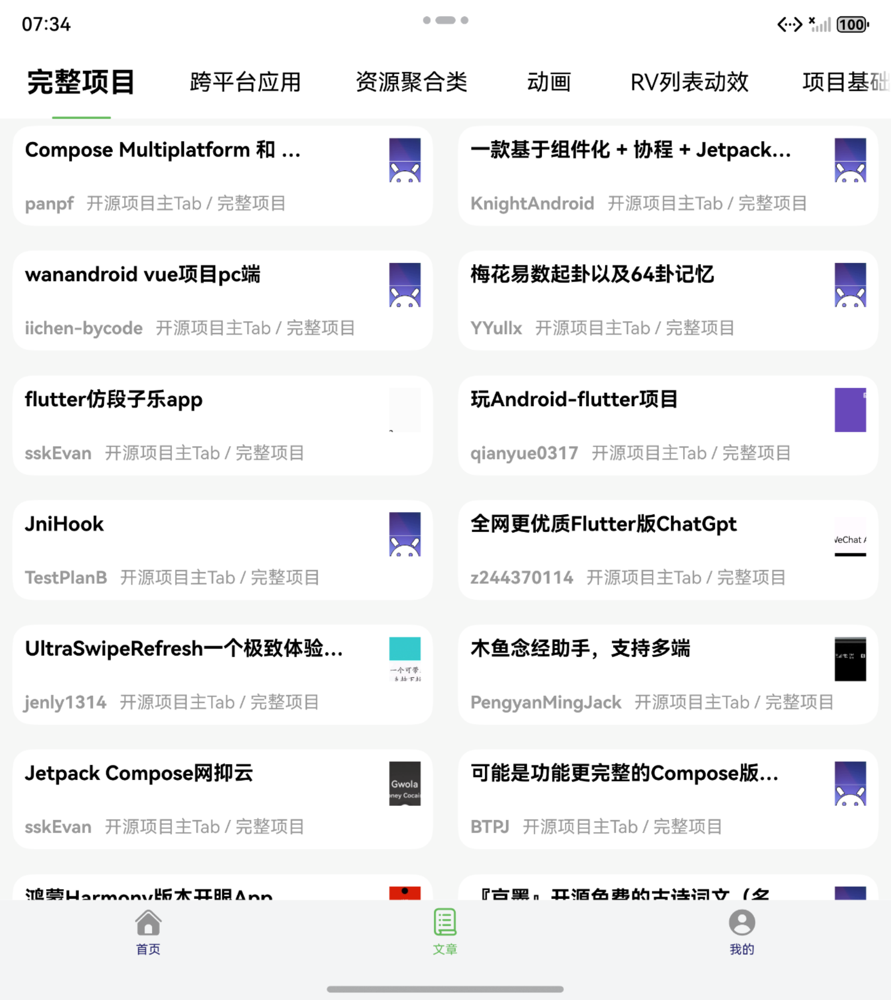

## 玩Android HarmonyOS 版
### 简介
玩Android 采用ArkTS语言编写，采用分层架构+模块化等架构，进行一多适配

### 功能
- 主页
- 项目
- 登录/注册
- 我的分享
- 我的收藏
- 深色模式
- 浏览文章、分享文章
- 我的积分、积分排行榜
- 我的消息

### 项目截图

|  直板机   | 两折叠  |
|  :----:  | :----:  |
|   |  |
|   |  |
|   |  |
|   |  |

### 技术点
- [HMRouter](https://developer.huawei.com/consumer/cn/doc/best-practices/bpta-hmrouter)
- [DialogHub](https://developer.huawei.com/consumer/cn/doc/best-practices/bpta-hadss_dialoghub)
- [PullToRefresh](https://gitee.com/openharmony-sig/ohos_pull_to_refresh)
- [ScrollComponents长列表](https://developer.huawei.com/consumer/cn/doc/best-practices/bpta-list-based-on-scrollcomponents#section14762914144214)
- [ScrollComponents网格](https://developer.huawei.com/consumer/cn/doc/best-practices/bpta-grid-based-on-scrollcomponents)
- [ScrollComponents瀑布流](https://developer.huawei.com/consumer/cn/doc/best-practices/bpta-waterflow-based-on-scrollcomponents)
- [axios](https://ohpm.openharmony.cn/#/cn/detail/@ohos%2Faxios)

### API
本项目接口来自于[玩Android](https://wanandroid.com/blog/show/2)，纯属学习交流使用，不得用于商业用途

### 尾言
如有任何疑问和建议请提[Issues](https://github.com/xufei5789651/HmWan/issues)；如果喜欢的话希望给个Star或Fork
